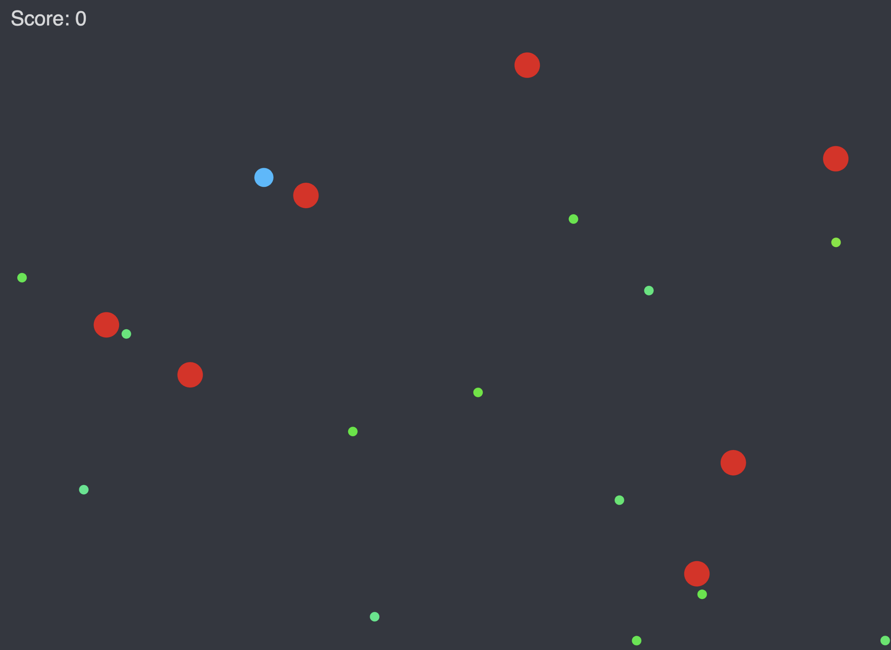

# CodeCanvas AI

**CodeCanvas AI** is an intelligent, AI-powered creative coding environment designed to supercharge your p5.js development. Built with Google's Gemini AI, it acts as your creative partner—helping you generate, debug, and refine interactive art and games through a natural language chat interface.



## 🚀 Features

- **🤖 AI-Powered Coding Assistant**: Chat with Gemini to generate p5.js sketches from scratch or modify existing ones using natural language.
- **⚡ Live Preview**: See your changes instantly. The integrated preview frame updates in real-time as you code or generate.
- **📝 Smart Code Editor**: Full-featured code editor with syntax highlighting (powered by `highlight.js`) and Markdown support.
- **🐛 Intelligent Debugging**: Encounter an error? The system captures runtime errors and offers an "Improve" button to automatically ask Gemini to fix the bug.
- **🔄 Interactive Controls**: Play, pause, and reset your sketches with intuitive toolbar controls.
- **🌗 Dual Modes**: Seamlessly switch between the **Gemini** chat tab for generation and the **Code** tab for manual fine-tuning.

## 🛠️ Tech Stack

This project is built using modern web technologies:

- **[Vite](https://vitejs.dev/)**: Next-generation frontend tooling for fast development.
- **[Lit](https://lit.dev/)**: Simple and fast web components.
- **[Google GenAI SDK](https://www.npmjs.com/package/@google/genai)**: Powering the AI capabilities with Gemini.
- **[p5.js](https://p5js.org/)**: The core creative coding library.
- **[Marked](https://marked.js.org/)** & **[Highlight.js](https://highlightjs.org/)**: For beautiful code rendering and syntax highlighting.

## 📦 Getting Started

### Prerequisites

- Node.js (v18 or higher)
- npm or yarn

### Installation

1. **Clone the repository**
   ```bash
   git clone https://github.com/DeshDeepakKant/CodeCanvas_AI.git
   cd CodeCanvas_AI
   ```

2. **Install dependencies**
   ```bash
   npm install
   ```

3. **Start the development server**
   ```bash
   npm run dev
   ```

4. **Open in Browser**
   Navigate to `http://localhost:5173` (or the URL shown in your terminal) to start creating!

## 🎮 Usage

1. **Chat**: Type a prompt like "Create a bouncing ball simulation with gravity" in the chat input.
2. **Generate**: Gemini will generate the code and automatically run it in the preview window.
3. **Refine**: Ask for changes like "Make the ball change color when it hits the wall."
4. **Edit**: Switch to the **Code** tab to manually tweak the generated code.
5. **Fix**: If the sketch crashes, click the **Improve** button in the chat to have AI fix the error.

## 👤 Author

**DeshDeepakKant**

- **GitHub**: [@DeshDeepakKant](https://github.com/DeshDeepakKant)
- **LinkedIn**: [DeshDeepakKant](https://www.linkedin.com/in/DeshDeepakKant)
- **Email**: [deshdeepakkant@gmail.com](mailto:deshdeepakkant@gmail.com)

---

*Built with ❤️ and 🤖*
